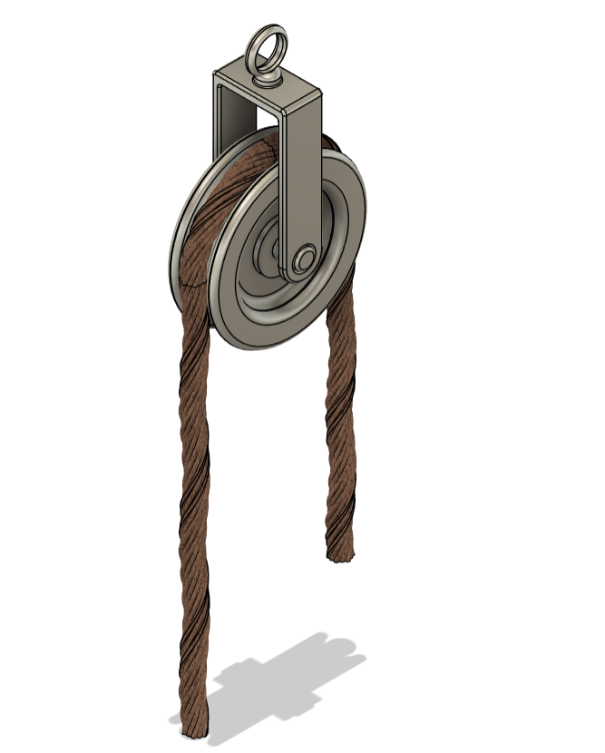
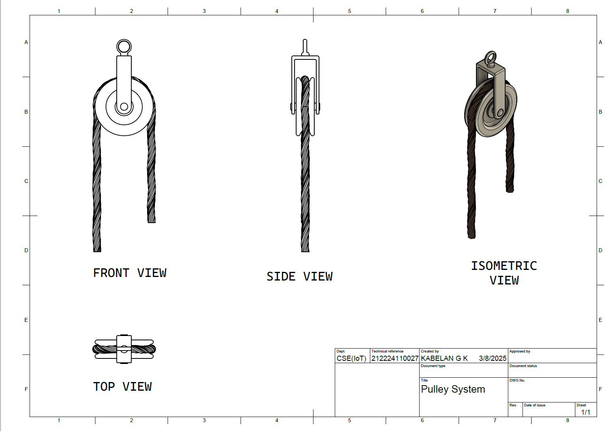

# Pulley System with Wire Rope
## Date: 09-03-2025

## AIM
To create a 3D model of a pulley system with wire rope using Autodesk Fusion 360.

## REQUIREMENTS
1. Autodesk Fusion 360
2. Windows 10
3. 16 GB of RAM (Integrated graphics recommend 1 GB or more)
4. 2.5 Mbps or faster download; 500 Kbps or faster upload

## PROCEDURE

### STEP-1: Start a New Design
   1. Open Autodesk Fusion 360.
   2. Create a New Design file.

### STEP-2: Start Sketch for Pulley
   1. Select **Sketch > Create Sketch**.
   2. Select the **Front Plane (XZ Plane)**.

### STEP-3: Draw the Pulley Profile
   1. Draw a **vertical centerline** from the origin.
   2. Using **Line tool**, sketch half of the pulley profile based on the required shape (groove and outer surface).
   3. Ensure the profile is **closed** for revolve operation.

### STEP-4: Revolve the Pulley
   1. Select **Create > Revolve**.
   2. Choose the pulley profile as the shape.
   3. Select the **vertical centerline** as the axis.
   4. Set the revolve angle to **360 degrees**.
   5. Confirm to create the 3D pulley body.

### STEP-5: Create the Central Hole
   1. Start a new **Sketch** on the front face.
   2. Draw a **Circle** centered on the pulley.
   3. Dimension the circle for the central shaft hole size.
   4. Finish the sketch.
   5. Use **Extrude > Cut** through the body to create the hole.

### STEP-6: Apply Fillets
   1. Select **Modify > Fillet**.
   2. Apply fillets to the edges where needed (to smoothen the groove and side transitions).

### STEP-7: Sketch the Wire Rope Path
   1. Start a **new Sketch** on the Front Plane.
   2. Draw the path of the wire rope passing over the pulley using **Arc** and **Line** tools.

### STEP-8: Create the Wire Rope
   1. Draw a **small circle** representing the cross-section of the rope.
   2. Use **Sweep Tool**: 
      - Select the rope circle as the profile.
      - Select the path sketched earlier as the path.
   3. Complete the Sweep to form the 3D wire rope.

### STEP-9: Appearance and Material Application
   1. Open **Modify > Appearance**.
   2. Apply a **metallic material** to the pulley (e.g., Steel).
   3. Apply a **wire or rubber-like material** to the rope.
   4. Adjust color/texture if needed.

### STEP-10: Save the File
   Save the completed design.

## INPUT

## OUTPUT
### Isometric view :

### Drawing 

## RESULT
Thus, the 3D model of the Pulley System with Wire Rope is created successfully using Fusion 360. (All files attached to the repo)
